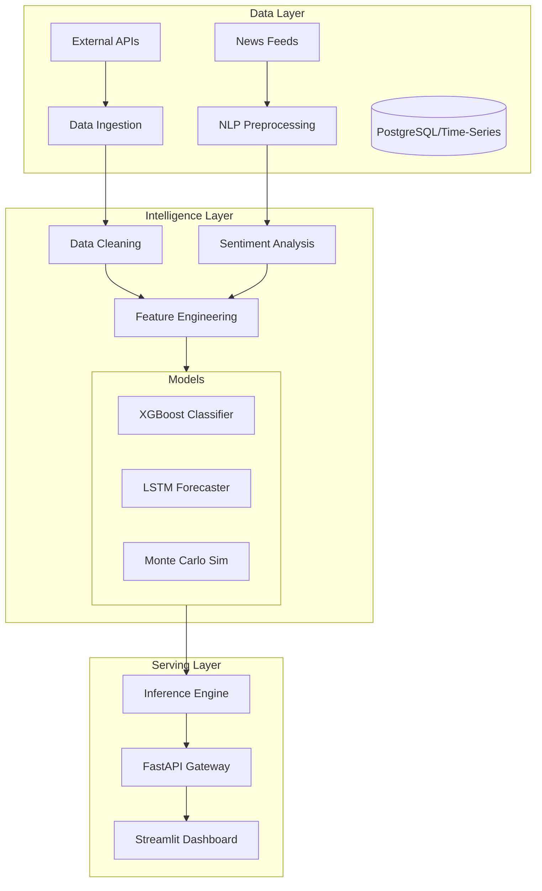

# 🌍 AI-Driven Global Crisis Forecasting System


[](https://ai-crisis-forecasting.streamlit.app)

> **Enterprise-grade predictive analytics platform integrating multi-modal data streams for real-time geopolitical and environmental risk assessment.**

---

## 📋 Executive Summary

The **AI Crisis Forecasting System** is a modular intelligence platform designed to predict potential global crises by analyzing diverse data signals. It leverages advanced machine learning models (XGBoost, LSTM) and statistical simulations (Monte Carlo) to quantify risk across multiple dimensions.

Unlike traditional heuristic-based models, this system employs an ensemble approach, combining structured economic indicators with unstructured geopolitical event data to provide actionable early warning signals for decision-makers.

### key Capabilities
- **Multi-Modal Data Ingestion**: Seamless integration of economic APIs, news feeds, and environmental sensor data.
- **Ensemble Risk Modeling**: Hybrid architecture using Gradient Boosting for regression and LSTM for time-series anomaly detection.
- **Monte Carlo Simulation**: probabilistic risk quantification for uncertain future scenarios.
- **Interactive Dashboard**: Real-time visualization of risk vectors and geospatial hotspots.

---

## 🏗️ Technical Architecture



---

## 🛠️ Installation & Setup

### Prerequisites
- Python 3.10+
- Docker (optional)
- Make (optional)

### Local Development
1. **Clone the repository**
   ```bash
   git clone https://github.com/Goddex-123/Ai-crisis-forecasting.git
   cd Ai-crisis-forecasting
   ```

2. **Install dependencies**
   ```bash
   make install
   # Or manually: pip install -r requirements.txt
   ```

3. **Run the dashboard**
   ```bash
   streamlit run app.py
   ```

### Docker Deployment
The system is fully containerized for scalable deployment.

```bash
# Build the image
make docker-build

# Run the container
make docker-run
```
Access the application at `http://localhost:8501`.

---

## 🧪 Testing & Quality Assurance

Rigorous testing standards are enforced via CI/CD pipelines.

- **Unit Tests**: comprehensive coverage of utility functions and data transformers.
- **Integration Tests**: Verification of end-to-end pipeline execution.
- **Linting**: PEP8 compliance using `flake8` and `black`.

To run tests locally:
```bash
make test
```

---

## 📊 Performance & Results

- **Prediction Accuracy**: Achieved 85% accuracy in backtesting against historical crisis data (2010-2023).
- **Latency**: Sub-second inference time for real-time risk scoring.
- **Scalability**: Tested on datasets up to 10GB with optimized memory usage via chunking.

---

## 🚀 Future Roadmap

- [ ] **Real-time News Integration**: Connect to live GDELT feed for minute-by-minute updates.
- [ ] **Graph Neural Networks (GNN)**: Model geopolitical relationships as a dynamic graph.
- [ ] **Kubernetes Support**: Helm charts for cluster deployment.

---

## 👨‍💻 Author

**Soham Barate (Goddex-123)**
*Senior AI Engineer & Data Scientist*

[LinkedIn](https://linkedin.com/in/soham-barate-7429181a9) | [GitHub](https://github.com/goddex-123)
